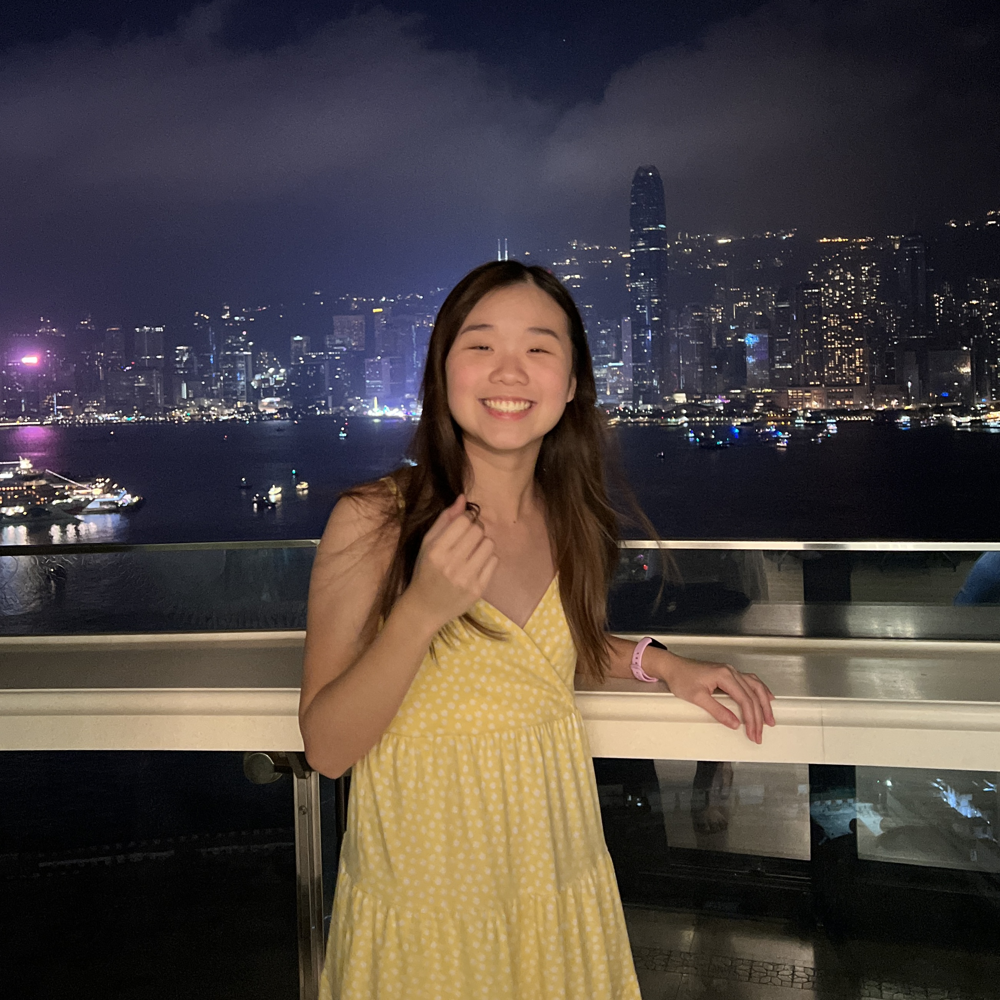

# Jolie Ng

-   **Hometown**: Hong Kong
-   **Hobbies**: singing, running, skiing, watching football (especially college ball!)
-   **First Computer I Ever Saw**: The first computer I ever saw was an old desktop PC running Windows XP that my dad owned. I remember being fascinated by the simple games like Solitaire and Minesweeper on there, and begging my dad to let me play them all the time!
-   **About me**: Hi everyone! I'm a physics and data science double major, and I'm so excited to be in the first ever BSDS class! I love travelling and have done it a LOT: I was born in Vancouver, Canada but grew up mainly in Hong Kong, then I went to a boarding school in Exeter, NH for high school! I am really passionate about the intersection between data analysis and AI and hope to do something with that in my future career(s) (my dream job is to become a data analyst in the NFL/Olympics!).
